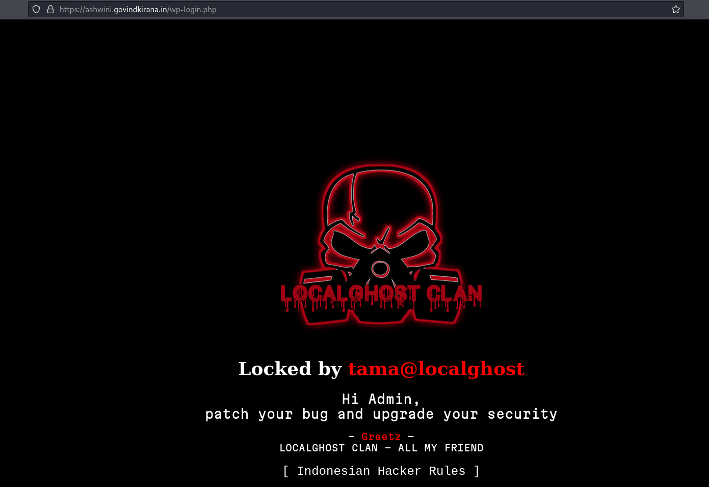

# Indian-Cyber-threat-intelligence
## Monitoring hacked websites and systems

### apacedevelopers.in [🔎 &#x2192;](https://apacedevelopers.in/)

### ashwini.govindkirana.in [🔎 &#x2192;](https://ashwini.govindkirana.in/wp-login.php)

### norres.icvgroup.in [🔎 &#x2192;](https://norres.icvgroup.in/lko_nor_gur_vij_admpnl/)

### designkidsfurniture.com [🔎 &#x2192;](https://designkidsfurniture.com/)

### amrita.olabs.edu.in [🔎 &#x2192;](https://amrita.olabs.edu.in/userfiles/media/pwn.gif)

